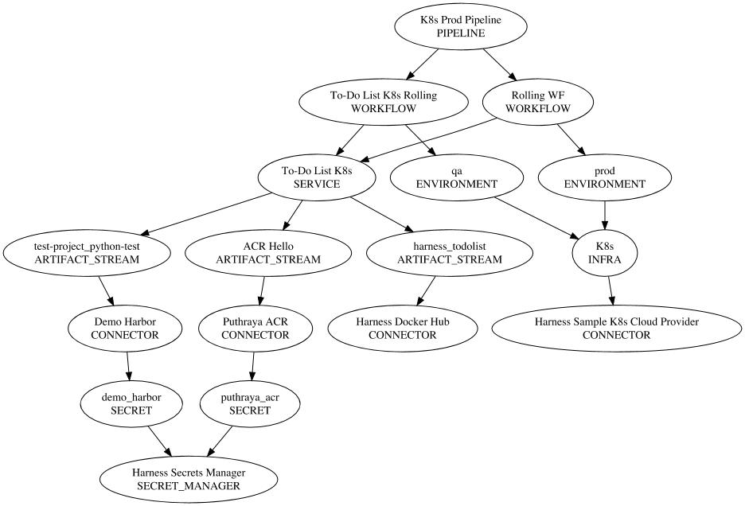

# Key Concepts
Before we start the upgrade process, it's essential to understand what, why, and how behind the upgrade tool.

## Idempotent
The upgrade tool is idempotent, which means it won't create or update another entity in the same scope once an entity is created in the next generation. It is also deterministic because it always creates the entities with the same name and identifier.

:::info
If you want to update one or more entities, delete them in next-gen and rerun the upgrade.
:::

:::caution Exception
An exception to this is Service & Environment overrides as they get updated every time.
:::

## Migrates referenced entities
The upgrade tool can migrate one or more entities simultaneously. It ensures to migrate entities that the entity is referencing and its subsequent entities. For example, if we want to migrate a pipeline, it will create connectors, secrets, and other related entities as well.

## Scopes
This is more of a next-generation concept than an upgrade, but it's a key concept to be aware of. In first-gen, connectors & secrets were always account-level entities, and it was not possible to create them at the application level. In next-gen, we have org & project scopes that give more control over how these entities are managed. The upgrade tool provides the ability to scope entities to account, org & project, so one can leverage these capabilities early on.

| CG Entity        | NG Entity                                | Default Scope | Recommended Scope | Configurable |   
|------------------|------------------------------------------|---------------|-------------------|--------------|
| Secret Manager   | Connectors                               | Project       | Account           | Yes          |  
| Cloud Providers  | Connectors                               | Project       | Account           | Yes          |
| Connectors       | Connectors                               | Project       | Account           | Yes          |
| Templates        | Step Templates, Artifact Source Template | Project       | Account           | Yes          |
| User Groups      | User Groups                              | Account       | Account           | No           |
| Service          | Service                                  | Project       | Project           | No           |
| Environment      | Environment                              | Project       | Project           | No           |
| Infrastructure   | Infrastructure                           | Project       | Project           | No           |
| Workflows        | Stage Templates or Pipelines             | Project       | Project           | Yes          |
| Pipeline         | Pipeline                                 | Project       | Project           | No           |
| Inline Manifests | File Store                               | Project       | Project           | No           |
| Triggers         | Triggers                                 | Project       | Project           | No           |
| App Defaults     | Project level Variables                  | Project       | Project           | No           |

:::tip
Before you get started, take some time to think about how you would like to structure your account in next-gen.
:::

:::caution
Once the scopes of entities during migration are set, they should not be changed. Providing different scopes each time will result in the same First-Gen entity in multiple NG scopes.
:::
